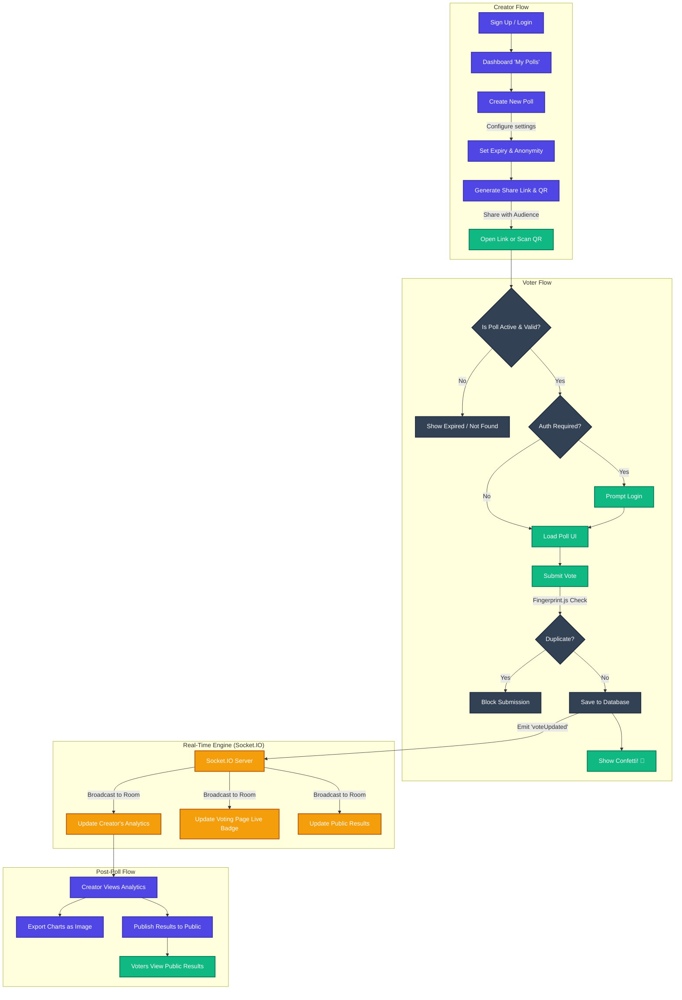

# 📊 PulseBoard

PulseBoard is a modern, real-time polling platform designed for speed, security, and aesthetics. Built for the Poll mannagement, it allows users to create interactive polls, gather responses anonymously or securely, and watch the results stream in live.

## ✨ Features

- **Real-Time Analytics:** Watch votes stream in live with Socket.IO integration.
- **Dynamic Poll Creation:** Add/remove questions and options dynamically. Toggle questions as mandatory or optional.
- **Fingerprint Security:** Prevents duplicate voting on anonymous polls using device fingerprinting.
- **Live Expiry Countdowns:** Polls automatically expire based on the creator's set time.
- **Beautiful UI/UX:** Built with Tailwind CSS v4, supporting both Light and Dark modes with smooth transitions, glassmorphic elements, and gradient typography.
- **Public & Private Results:** Creators control when results are published to the public.
- **Gamification & Export:** Confetti animations on successful votes, QR code sharing, and image export (html2canvas) of the final charts.

## 🛠️ Tech Stack

- **Frontend:** React 19, Vite, TanStack Router, Tailwind CSS v4, Recharts, React Hook Form, Zod.
- **Backend:** Node.js, Express.js 5, MongoDB (Mongoose), Socket.IO.
- **Security:** JWT Authentication, HttpOnly Cookies, FingerprintJS.

## 🔐 Test Credentials (For Judges)

To quickly test the application and view the dashboard and analytics, you can use the following test account:

- **Email:** `test@gmail.com`
- **Password:** `Rajib@123`

## 🚀 How to Run Locally

1. **Clone the repository:**

   ```bash
   git clone <your-repo-url>
   cd PulseBoard
   ```

2. **Setup Backend:**

   ```bash
   cd server
   npm install
   ```

   - Create a `.env` file in the `server` directory with:
     ```env
     PORT=3000
     MONGODB_URI=your_mongodb_connection_string
     ACCESS_TOKEN_SECRET=your_access_secret
     ACCESS_TOKEN_EXPIRY=1d
     REFRESH_TOKEN_SECRET=your_refresh_secret
     REFRESH_TOKEN_EXPIRY=10d
     FRONTEND_URL=http://localhost:5173
     ```
   - Run the backend: `npm run dev`

3. **Setup Frontend:**
   ```bash
   cd client
   npm install
   ```

   - Create a `.env` file in the `client` directory with:
     ```env
     VITE_API_URL=http://localhost:3000/api/v1
     ```
   - Run the frontend: `npm run dev`

## 🎨 Highlights

- **Recharts** for beautiful, animated horizontal bar charts.
- **TanStack Router** for fully typesafe, directory-based routing.
- **Tailwind v4** utilizing custom CSS variables for effortless dark mode.

## 🔄 System Architecture & Flow



---

_Built with ❤️ for the live Polls_
